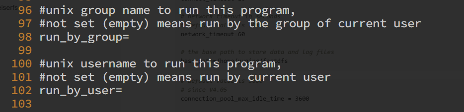

## 前言

如果你的 FastDFS 文件系统需要高可用，需要部署在多台机器上的话，并且你的这些服务器上只跑 FastDFS 这个服务，那么 FastDFS 可能并不适合用 Docker 来部署，按照官方文档直接部署在机器上就可以，没必要采用容器来部署。其实 FastDFS 并不适合容器化部署，因为 tracker 服务器向 storage 服务器报告自己的 IP， 而这个 IP 是容器内的 IP 。是 Docker 的一个私有 IP 段，这将导致客户端无法访问 storage 服务器。当然如果使用 host 网络或者能打通客户端到 storage 的网络解决方案，比如 flannel ，calico 等，这都可以，在 Kubernetes 基于服务发现，客户端也可以访问到 storage 服务器。

那么 FastDFS 采用 Docker 部署适用于什么场景呢？其实比较适合中小型的项目，对高可用，高性能要求不大的情况下。或者将 FastDFS 所有的服务封装在一个容器里运行，和其他服务一起使用 docker-compose 启动，这样用再适合不过了。我的项目就是这种场景，由于服务器资源有限，不可能去单独部署一个 FastDFS 服务器集群，巴拉巴拉整个高可用。所有的项目组件都采用 Docker 部署在一台机器上，FastDFS 里的  nginx 也是没有单独去部署，和 tracker、storage 服务器一起装在一个容器里。为了节省资源没得办法😂

##  构建 docker 镜像

### 准备所需源码

```bash
# 先在本地新建一个 src 目录，所有的文件都放在这个目录下
mkdir src
cd src/
git clone https://github.com/happyfish100/libfastcommon.git --depth 1
git clone https://github.com/happyfish100/fastdfs.git --depth 1
git clone https://github.com/happyfish100/fastdfs-nginx-module.git --depth 1
wget http://nginx.org/download/nginx-1.15.4.tar.gz
tar -zxvf nginx-1.15.4.tar.gz

# 复制所需要的配置文件
rm -rf fastdfs/conf
cp -rf fastdfs/docker/dockerfile_local/conf fastdfs/conf
cp fastdfs/docker/dockerfile_local/fastdfs.sh fastdfs/conf

# 删除不必要的文件，减小镜像体积
rm -rf fastdfs/.git fastdfs-nginx-module/.git libfastcommon/.git/ fastdfs/docker/
```

### 修改配置文件

所有的配置文件都在 conf 里，我们根据自身的需要修改一下各个配置文件即可

```bash
╭─root@debian-deploy-132 ~/src/conf
╰─# tree
.
├── client.conf             # C 语言版本客户端配置文件，可以忽略
├── fastdfs.sh              # docker 容器启动 fastdfs 服务的脚本
├── http.conf               # http 配置文件，参考官方文档
├── mime.types
├── mod_fastdfs.conf        # fastdfs nginx 模块配置文件
├── nginx.conf              # nginx 配置文件，根据自身项目修改
├── storage.conf            # storage 服务配置文件
└── tracker.conf            # tracker 服务配置文件
```

#### tracker 服务配置文件 tracker.conf

```ini
disabled=false                #启用配置文件
port=22122                    #设置tracker的端口号
base_path=/home/dfs           #设置tracker的数据文件和日志目录（需预先创建）
http.server_port=8080         #设置http端口号
```

#### storage 服务配置文件 storage_ids.conf

```ini
# storage服务端口
port=23000                         # 数据和日志文件存储根目录
base_path=/home/dfs                # 第一个存储目录
store_path0=/home/dfs              # tracker服务器IP和端口
http.server_port=8888
```

#### nginx 配置文件 nginx.conf   

```nginx
# 在 nginx 配置文件中添加修改下面这段
server {
    listen       8888;    ## 该端口为storage.conf中的http.server_port相同
    server_name  localhost;
    location ~/group[0-9]/ {
        ngx_fastdfs_module;
    }
    error_page   500 502 503 504  /50x.html;
    location = /50x.html {
    root   html;
    }
}
```

#### nginx 模块配置文件 mod_fastdfs.conf 

```ini
tracker_server=10.10.107.232:22122   # tracker服务器IP和端口
url_have_group_name=true             # url 中包含 group 的名称
store_path0=/home/dfs                # 数据和日志文件存储根目录
```

#### fastdfs 服务的脚本 fastdfs.sh

官方的脚本写的很随意，我就修改了一哈，不修改按照官方的来也 ok

```bash
#!/bin/bash

new_val=$FASTDFS_IPADDR
old="com.ikingtech.ch116221"

sed -i "s/$old/$new_val/g" /etc/fdfs/client.conf
sed -i "s/$old/$new_val/g" /etc/fdfs/storage.conf
sed -i "s/$old/$new_val/g" /etc/fdfs/mod_fastdfs.conf

cp /etc/fdfs/nginx.conf /usr/local/nginx/conf

echo "start trackerd"
/etc/init.d/fdfs_trackerd start

echo "start storage"
/etc/init.d/fdfs_storaged start

echo "start nginx"
/usr/local/nginx/sbin/nginx

tail -f  /dev/null                
```

#### 把 bash 替换成 sh

其实这一步骤可以不做，使用 bash 启动的话，需要在 alpine 安装 bash ，会增加 6MB 左右的镜像大小，感觉也没必要这样做😂

```bash
sed -i 's/bash/sh/g' `grep -nr bash | awk -F ':' '{print $1}'`

# 替换后
grep -nr \#\!\/bin\/sh
stop.sh:1:#!/bin/sh
init.d/fdfs_storaged:1:#!/bin/sh
init.d/fdfs_trackerd:1:#!/bin/sh
conf/fastdfs.sh:1:#!/bin/sh
restart.sh:1:#!/bin/sh
docker/dockerfile_local/fastdfs.sh:1:#!/bin/sh
docker/dockerfile_network/fastdfs.sh:1:#!/bin/sh
```

### Dockerfile

```dockerfile

```


##  测试


### 3.1 测试工具

1. 上传客户端：`fdfs_upload_file`
2. 并发执行工具 ：`xargs`
3. 测试样本：10W  张表情包图片 ，大小在 **8KB–128KB** 之间
4. 上传测试命令：```time ls  | xargs -n 1 -I {} -P 256 sh -c "/usr/bin/fdfs_upload_file /etc/fdfs/client.conf {}"```   `-p 参数指定并发执行的任务数量` 
5. 下载测试工具： `wget`

```bash
下载测试命令：`time cat url.log  | xargs -n 1 -I {} -P 256 sh -c "wget  {}"`
```

### 3.2 文件上传测试


**3.2.1 测试样本为 10W 张 8KB-100 KB 大小不等的图片**


**3.2.2 测试文件数量和大小**


**3.2.3 使用 xargs 执行 256 个进程并发上传 10w 张照片所用所用时间 为 2 分钟左右（内网）**


**3.2.4 用时 2 分 11 秒**


**3.2.5 客户端负载情况**


**3.2.6 服务端负载情况**


**3.2.7 服务端带宽流量**


**3.2.8 服务端带宽流量**


**3.2.9 服务端上传结果**


**3.2.10 服务端上传日志记录 ，均无错误输出**


### 3.3 文件下载测试

**3.3.1 从日志中提取文件路径**

从服务端的 `storage_access.log` 日志里提取出文件的路径，使用 `sed` 添加 `nginx` 的访问端口地址得到 10W 个记录 上传文件的 `http` 访问 `url` 地址


**3.3.2 wget 下载**

使用 `wget -i` 参数指定 `url.log` 为标准输出来测试下载刚刚上传的 10W 张图片 用时 3 分 23 秒


### 3.4 测试结果分析

使用 FastDFS 自带的上传测试工具和 xargs 并发执行工具，通过 xargs -P 参数指定的并发请求数，测得结果为单机性能在网络环境稳定的情况下可以达到 5000 并发上传请求。10W 张图片上传时间耗时 2 分 11 秒左右。使用定时脚本持续测试，总测试上传 100W 张图片。分析 tracker 服务器和 storage 服务器的日志，无论上传还是下载均未发现错误和异常，性能和稳定性较好。

## 4 优化参数

根据业务需求和线上环境调整一下参数，可充分发挥 FastDFS 文件系统的性能

```
# 接收请求的线程数数量
accept_threads=1

# work thread count, should <= max_connections
# default value is 4
# since V2.00
# 工作线程数量，应当小于等于最大连接数
work_threads=4

# min buff size
# default value 8KB
# 最小缓冲大小，默认值为 8KB
min_buff_size = 8KB

# max buff size
# default value 128KB
# 最大缓冲大小，默认值为 128KB
max_buff_size = 128KB

# thread stack size, should >= 64KB
# default value is 256KB
# 线程栈的大小，应当大于 64KB，默认为 256KB
thread_stack_size = 256KB

# if use connection pool
# default value is false
# since V4.05
# 是否使用连接池
use_connection_pool = false

# connections whose the idle time exceeds this time will be closed
# unit: second
# default value is 3600
# since V4.05
# 连接池的最大空闲时间
connection_pool_max_idle_time = 3600

```


## 5 常见问题

#### 5.1.1 无法连接到 tracker 服务器

需要在 tracker.conf 配置文件中添加允许访问的 IP ,并添加防火墙规则

```bash
[2019-07-25 10:40:54] ERROR - file: ../client/storage_client.c, line: 996, fdfs_recv_response fail, result: 107
upload file fail, error no: 107, error info: Transport endpoint is not connected
[2019-07-25 10:40:54] ERROR - file: tracker_proto.c, line: 37, server: 10.20.172.192:23000, recv data fail, errno: 107, error info: Transport endpoint is not connected
```

#### 5.1.2 storage 服务器磁盘用尽

当 storage 服务器设定的上传存储目录所在的分区磁盘用尽将会出现无剩余空间的错误日志

```bash
[2019-07-26 16:16:45] ERROR - file: tracker_proto.c, line: 48, server: 10.10.107.232:22122, response status 28 != 0
[2019-07-26 16:16:45] ERROR - file: ../client/tracker_client.c, line: 907, fdfs_recv_response fail, result: 28
tracker_query_storage fail, error no: 28, error info: No space left on device
```

#### 5.1.3 重启服务时失败

使用 service fdfs_trackerd restart 重启 tracker 或者 storage 服务时会报错，会提示端口已经占用。解决的方案就是使用 kill -9 命令杀死 tracker 服务或者 storage 服务，然后再重新启动相应服务即可

```bash
[2019-07-25 10:36:55] INFO - FastDFS v5.12, base_path=/home/dfs, run_by_group=, run_by_user=, connect_timeout=10s, network_timeout=60s, port=22122, bind_addr=, max_connections=1024, accept_threads=1, work_threads=4, min_buff_size=8,192, max_buff_size=131,072, store_lookup=2, store_group=, store_server=0, store_path=0, reserved_storage_space=10.00%, download_server=0, allow_ip_count=-1, sync_log_buff_interval=10s, check_active_interval=120s, thread_stack_size=256 KB, storage_ip_changed_auto_adjust=1, storage_sync_file_max_delay=86400s, storage_sync_file_max_time=300s, use_trunk_file=0, slot_min_size=256, slot_max_size=16 MB, trunk_file_size=64 MB, trunk_create_file_advance=0, trunk_create_file_time_base=02:00, trunk_create_file_interval=86400, trunk_create_file_space_threshold=20 GB, trunk_init_check_occupying=0, trunk_init_reload_from_binlog=0, trunk_compress_binlog_min_interval=0, use_storage_id=0, id_type_in_filename=ip, storage_id_count=0, rotate_error_log=0, error_log_rotate_time=00:00, rotate_error_log_size=0, log_file_keep_days=0, store_slave_file_use_link=0, use_connection_pool=0, g_connection_pool_max_idle_time=3600s
[2019-07-25 10:36:55] ERROR - file: sockopt.c, line: 868, bind port 22122 failed, errno: 98, error info: Address already in use.
[2019-07-25 10:36:55] CRIT - exit abnormally!
```

### 5.2 安全相关

1. tracker.conf 、storage.conf 配置文件默认允许所有 IP 地址访问 ，建议去掉  `allow_hosts=*` 修改为 FastDFS 客户端所在的内网 IP 地址。


2. tracker.conf 、storage.conf  默认配置文件监听的地址为 0.0.0.0 即本机所有的 IP 地址，建议修改为 FastDFS 服务器所在的内网 IP 地址。


3. 默认运行用户为当前用户和用户组为当前用户，建议指定为权限最小的用户来运行此进程。



### 5.3 release 版本问题

**fastdfs** 的 GitHub上的 repo 已经有两年没有 release 新版本了，是选用 2017 年的 v5.11 版本还是直接用 master 分支版本？

