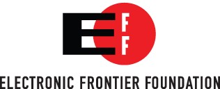

---

title: 电子前哨基金会历史
date: 2019-10-14

---

> # A History of Protecting Freedom Where Law and Technology Collide

> # 一段在法律与技术冲突的地方保护自由的历史

> The Electronic Frontier Foundation was founded in July of 1990 in response to a basic threat to speech. The United States Secret Service conducted a series of raids tracking the distribution of a document illegally copied from a BellSouth computer that described how the emergency 911 system worked, referred to as the E911 document. The Secret Service believed that if "hackers" knew how to use the telephone lines set aside for receiving emergency phone calls, the lines would become overloaded and people facing true emergencies would be unable to get through.

>   电子前哨基金会成立于 1990 年 7 月，皆在应对基本的言论威胁。美国特勤局进行了一系列地突袭，跟踪从BellSouth 计算机非法复制的文档的分发，该文档描述了紧急 911 系统的工作方式，称为 E911 文档。特勤局认为，如果“黑客”知道如何使用空闲的电话线来接听紧急电话，则电话线将变得超负荷，面对真正紧急情况的人将无法打通电话。

> One of the alleged recipients of the E911 document was the systems operator at a small games book publisher out of Austin, Texas, named Steve Jackson Games. The Secret Service executed a warrant against the innocent Jackson and took all electronic equipment and copies of an upcoming game book from Steve Jackson Games' premises. Steve Jackson panicked as he watched the deadline come and go for his latest release and still hadn't received his computers back. He was forced to lay off nearly half of his staff. In the end, the Secret Service returned all of Steve Jackson's computers and decided not to press charges against the company, since they were unable to find any copies of the E911 document on any of the computers.

> 

> EFF's original logo, in use from 1990-2018

> In the meantime, Steve Jackson's business was nearly ruined. And when he and his employees had the opportunity to investigate the returned computers, they noticed that all of the electronic mail that had been stored on the company's electronic bulletin board computer, where non-employee users had dialed in and sent personal messages to one another, had been individually accessed and deleted. Steve Jackson was furious, as he believed his rights as a publisher had been violated and the free speech and privacy rights of his users had been violated. Steve Jackson tried desperately to find a civil liberties group to help him, to no avail. Unfortunately, none of the existing groups understood the technology well enough to understand the importance of the issues.

> In an electronic community called the Whole Earth 'Lectronic Link (now WELL.com) several informed technologists understood exactly what civil liberties issues were involved. Mitch Kapor, former president of Lotus Development Corporation, John Perry Barlow, Wyoming cattle rancher and lyricist for the Grateful Dead, and John Gilmore, an early employee of Sun Microsystems, decided to do something about it. They formed an organization to work on civil liberties issues raised by new technologies. On the day they formally unveiled the new organization, they announced that they were representing Steve Jackson Games and several of the company's bulletin board users in a lawsuit they were bringing against the United States Secret Service. The Electronic Frontier Foundation was born!

> The Steve Jackson Games case turned out to be an extremely important one in the development of a proper legal framework for cyberspace. For the first time, a court held that electronic mail deserves at least as much protection as telephone calls. We take for granted today that law enforcement must have a warrant that particularly describes all electronic mail messages before seizing and reading them. The Steve Jackson Games case established that principle.

> The Electronic Frontier Foundation continues to take on cases that set important precedents for the treatment of rights in cyberspace. In our second big case, *Bernstein v. U.S. Dept. of Justice*, the United States government prohibited a University of California mathematics Ph.D. student from publishing on the Internet an encryption computer program he had created. Encryption is a method for scrambling messages so they can only be understood by their intended recipients. Years before, the government had placed encryption on the United States Munitions List, alongside bombs and flamethrowers, as a weapon to be regulated for national security purposes. Companies and individuals exporting items on the munitions list, including software with encryption capabilities, had to obtain prior State Department approval.

> Encryption export restrictions crippled American businesses and damaged the free speech rights of individuals. Critical for ecommerce, companies use encryption to safeguard sensitive information, such as credit card numbers, which they send or receive over electronic networks. Companies also secure access to software programs and provide system security using encryption. By limiting the export of encryption, technologies, and methods, the U.S. government drove development of security software overseas, where American companies were unable to compete.

> The State Department was unsympathetic to Bernstein's situation and told Bernstein he would need a license to be an arms dealer before he could simply post the text of his encryption program on the Internet. They also told him that they would deny him an export license if he actually applied for one, because his technology was too secure.

> The Electronic Frontier Foundation pulled together a top-notch legal team and sued the United States government on behalf of Dan Bernstein. The court ruled, for the first time ever, that written software code is speech protected by the First Amendment. The court further ruled that the export control laws on encryption violated Bernstein's First Amendment rights by prohibiting his constitutionally protected speech. As a result, the government changed its export regulations. Now everyone has the right to "export" encryption software -- by publishing it on the Internet -- without prior permission from the U.S. government. Once again, the Electronic Frontier Foundation led the charge to establish important cyberspace rights.

> ## Today's Issues

> While many early battles over the right to communicate freely and privately stemmed from government censorship, today EFF is fighting for users on many other fronts as well.

> Today, certain powerful corporations are attempting to shut down online speech, prevent new innovation from reaching consumers, and facilitating government surveillance. We challenge corporate overreach just as we challenge government abuses of power.

> We also develop technologies that can help individuals protect their privacy and security online, which our technologists build and release freely to the public for anyone to use.

> In addition, EFF is engaged in major legislative fights, beating back digital censorship bills disguised as intellectual property proposals, opposing attempts to force companies to spy on users, championing reform bills that rein in government surveillance, and much more .

> We are working with advocates worldwide to create a global digital environment that upholds both human rights and Constitutional rights, and we continue to take on cutting-edge legal cases to win victories for user rights.

