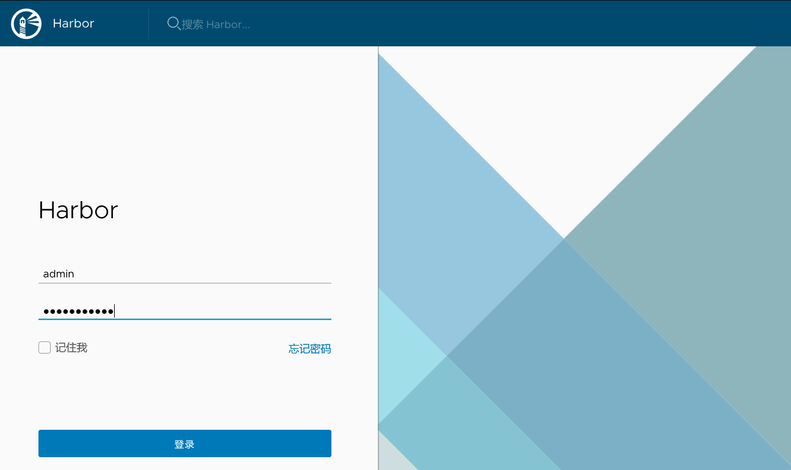
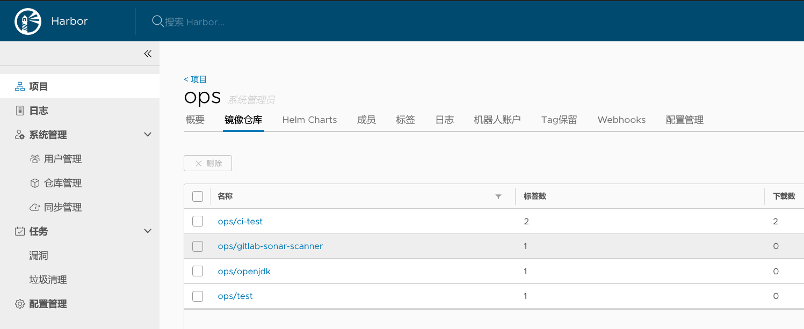
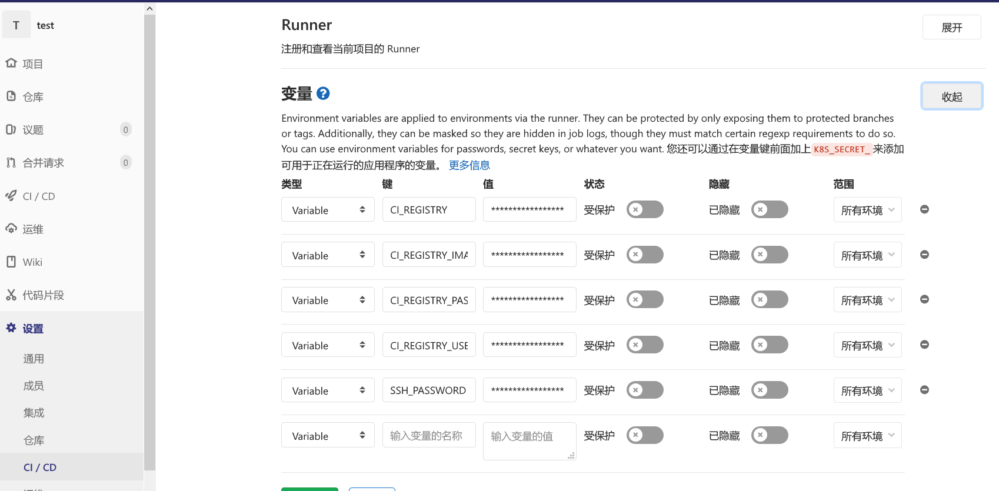
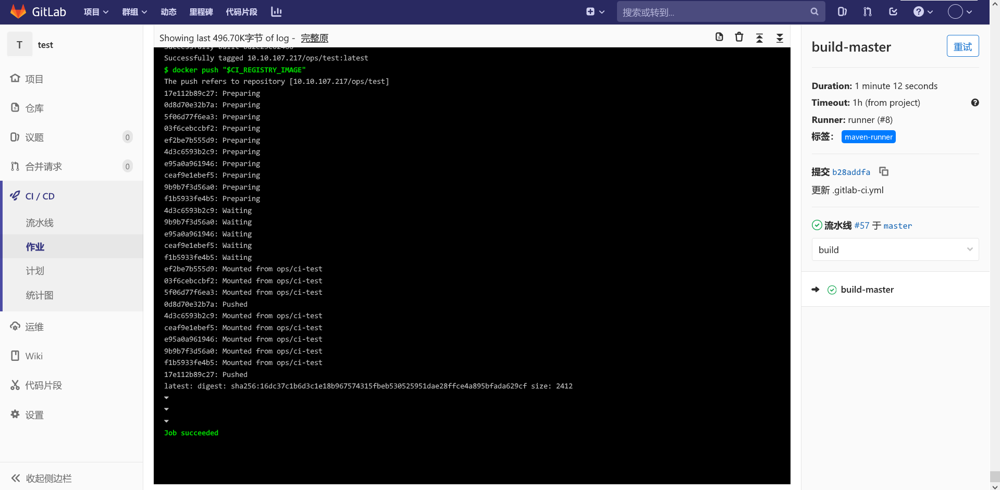

对于 CI/CD（持续集成与持续交付）的基本概念网络上已经有很多大佬在普及啦，咱才疏学浅怕误人子弟所以只能剽窃一下别人的解释啦😂。下面就剽窃一下红帽子家的 [CI/CD是什么？如何理解持续集成、持续交付和持续部署](https://www.redhat.com/zh/topics/devops/what-is-ci-cd) 官方文档

**CI 持续集成**


> CI/CD 中的“CI”始终指持续集成，它属于开发人员的自动化流程。成功的 CI 意味着应用代码的新更改会定期构建、测试并合并到共享存储库中。该解决方案可以解决在一次开发中有太多应用分支，从而导致相互冲突的问题。

**CD 持续交付**


> CI/CD 中的“CD”指的是持续交付和/或持续部署，这些相关概念有时会交叉使用。两者都事关管道后续阶段的自动化，但它们有时也会单独使用，用于说明自动化程度。
>
> 持续*交付*通常是指开发人员对应用的更改会自动进行错误测试并上传到存储库（如 [GitHub](https://redhatofficial.github.io/#!/main) 或容器注册表），然后由运维团队将其部署到实时生产环境中。这旨在解决开发和运维团队之间可见性及沟通较差的问题。因此，持续交付的目的就是确保尽可能减少部署新代码时所需的工作量。

**持续部署**


> 持续*部署*（另一种“CD”）指的是自动将开发人员的更改从存储库发布到生产环境，以供客户使用。它主要为了解决因手动流程降低应用交付速度，从而使运维团队超负荷的问题。持续部署以持续交付的优势为根基，实现了管道后续阶段的自动化。

总之而言  CI/CD 是一整套软件开发的流水线，开发人员提交完更新的代码之后，根据流水线的触发情况来执行自定义的流水线任务，比如代码质量检测、构建 docker 镜像为交付产品、自动化部署到测试环境或生产环境。这些需要

## 选型

## 安装 GitlabSS

目前 Gitlab 官方给出的安装方式有很多种，普遍采用 Omnibus 包、Docker 安装。官方建议采用 Omnibus 方式安装：

> 我们强烈建议使用 Omnibus 包安装 GitLab ，因为它安装起来更快、更容易升级版本，而且包含了其他安装方式所没有的可靠性功能。

### Omnibus 包安装方式比较

- ✅ - Installed by default
- ⚙ - Requires additional configuration, or GitLab Managed Apps
- ⤓ - Manual installation required
- ❌ - Not supported or no instructions available
- N/A - Not applicable

| Component                                                    | Description                                                  |      [Omnibus GitLab](https://docs.gitlab.com/omnibus/)      |       [GitLab chart](https://docs.gitlab.com/charts/)        |              [GitLab.com](https://gitlab.com/)               |
| :----------------------------------------------------------- | :----------------------------------------------------------- | :----------------------------------------------------------: | :----------------------------------------------------------: | :----------------------------------------------------------: |
| [NGINX](https://docs.gitlab.com/ee/development/architecture.html#nginx) | Routes requests to appropriate components, terminates SSL    |        [✅](https://docs.gitlab.com/omnibus/settings/)        |      [✅](https://docs.gitlab.com/charts/charts/nginx/)       | [✅](https://about.gitlab.com/handbook/engineering/infrastructure/production/architecture/#service-architecture) |
| [Unicorn (GitLab Rails)](https://docs.gitlab.com/ee/development/architecture.html#unicorn) | Handles requests for the web interface and API               |  [✅](https://docs.gitlab.com/omnibus/settings/unicorn.html)  |  [✅](https://docs.gitlab.com/charts/charts/gitlab/unicorn/)  | [✅](https://docs.gitlab.com/ee/user/gitlab_com/index.html#unicorn) |
| [Sidekiq](https://docs.gitlab.com/ee/development/architecture.html#sidekiq) | Background jobs processor                                    | [✅](https://gitlab.com/gitlab-org/omnibus-gitlab/blob/master/files/gitlab-config-template/gitlab.rb.template) |  [✅](https://docs.gitlab.com/charts/charts/gitlab/sidekiq/)  | [✅](https://docs.gitlab.com/ee/user/gitlab_com/index.html#sidekiq) |
| [Gitaly](https://docs.gitlab.com/ee/development/architecture.html#gitaly) | Git RPC service for handling all Git calls made by GitLab    | [✅](https://docs.gitlab.com/ee/administration/gitaly/index.html) |  [✅](https://docs.gitlab.com/charts/charts/gitlab/gitaly/)   | [✅](https://about.gitlab.com/handbook/engineering/infrastructure/production/architecture/#service-architecture) |
| [Praefect](https://docs.gitlab.com/ee/development/architecture.html#praefect) | A transparent proxy between any Git client and Gitaly storage nodes. | [✅](https://docs.gitlab.com/ee/administration/gitaly/index.html) |  [❌](https://docs.gitlab.com/charts/charts/gitlab/gitaly/)   | [✅](https://about.gitlab.com/handbook/engineering/infrastructure/production/architecture/#service-architecture) |
| [GitLab Workhorse](https://docs.gitlab.com/ee/development/architecture.html#gitlab-workhorse) | Smart reverse proxy, handles large HTTP requests             | [✅](https://gitlab.com/gitlab-org/omnibus-gitlab/blob/master/files/gitlab-config-template/gitlab.rb.template) |  [✅](https://docs.gitlab.com/charts/charts/gitlab/unicorn/)  | [✅](https://about.gitlab.com/handbook/engineering/infrastructure/production/architecture/#service-architecture) |
| [GitLab Shell](https://docs.gitlab.com/ee/development/architecture.html#gitlab-shell) | Handles `git` over SSH sessions                              | [✅](https://gitlab.com/gitlab-org/omnibus-gitlab/blob/master/files/gitlab-config-template/gitlab.rb.template) | [✅](https://docs.gitlab.com/charts/charts/gitlab/gitlab-shell/) | [✅](https://about.gitlab.com/handbook/engineering/infrastructure/production/architecture/#service-architecture) |
| [GitLab Pages](https://docs.gitlab.com/ee/development/architecture.html#gitlab-pages) | Hosts static websites                                        | [⚙](https://docs.gitlab.com/ee/administration/pages/index.html) |  [❌](https://gitlab.com/gitlab-org/charts/gitlab/issues/37)  | [✅](https://docs.gitlab.com/ee/user/gitlab_com/index.html#gitlab-pages) |
| [Registry](https://docs.gitlab.com/ee/development/architecture.html#registry) | Container registry, allows pushing and pulling of images     | [⚙](https://docs.gitlab.com/ee/administration/packages/container_registry.html#container-registry-domain-configuration) |     [✅](https://docs.gitlab.com/charts/charts/registry/)     | [✅](https://docs.gitlab.com/ee/user/packages/container_registry/index.html#build-and-push-images-using-gitlab-cicd) |
| [Redis](https://docs.gitlab.com/ee/development/architecture.html#redis) | Caching service                                              |   [✅](https://docs.gitlab.com/omnibus/settings/redis.html)   |   [✅](https://docs.gitlab.com/omnibus/settings/redis.html)   | [✅](https://about.gitlab.com/handbook/engineering/infrastructure/production/architecture/#service-architecture) |
| [PostgreSQL](https://docs.gitlab.com/ee/development/architecture.html#postgresql) | Database                                                     | [✅](https://docs.gitlab.com/omnibus/settings/database.html)  | [✅](https://github.com/helm/charts/tree/master/stable/postgresql) | [✅](https://docs.gitlab.com/ee/user/gitlab_com/index.html#postgresql) |
| [PgBouncer](https://docs.gitlab.com/ee/development/architecture.html#pgbouncer) | Database connection pooling, failover                        | [⚙](https://docs.gitlab.com/ee/administration/high_availability/pgbouncer.html) | [❌](https://docs.gitlab.com/charts/installation/deployment.html#postgresql) | [✅](https://about.gitlab.com/handbook/engineering/infrastructure/production/architecture/#database-architecture) |
| [Consul](https://docs.gitlab.com/ee/development/architecture.html#consul) | Database node discovery, failover                            | [⚙](https://docs.gitlab.com/ee/administration/high_availability/consul.html) | [❌](https://docs.gitlab.com/charts/installation/deployment.html#postgresql) | [✅](https://docs.gitlab.com/ee/user/gitlab_com/index.html#consul) |
| [GitLab self-monitoring: Prometheus](https://docs.gitlab.com/ee/development/architecture.html#prometheus) | Time-series database, metrics collection, and query service  | [✅](https://docs.gitlab.com/ee/administration/monitoring/prometheus/index.html) | [✅](https://github.com/helm/charts/tree/master/stable/prometheus) | [✅](https://docs.gitlab.com/ee/user/gitlab_com/index.html#prometheus) |
| [GitLab self-monitoring: Alertmanager](https://docs.gitlab.com/ee/development/architecture.html#alertmanager) | Deduplicates, groups, and routes alerts from Prometheus      | [⚙](https://gitlab.com/gitlab-org/omnibus-gitlab/blob/master/files/gitlab-config-template/gitlab.rb.template) | [✅](https://github.com/helm/charts/tree/master/stable/prometheus) | [✅](https://about.gitlab.com/handbook/engineering/monitoring/) |
| [GitLab self-monitoring: Grafana](https://docs.gitlab.com/ee/development/architecture.html#grafana) | Metrics dashboard                                            | [✅](https://docs.gitlab.com/ee/administration/monitoring/performance/grafana_configuration.html) | [⤓](https://github.com/helm/charts/tree/master/stable/grafana) | [✅](https://dashboards.gitlab.com/d/RZmbBr7mk/gitlab-triage?refresh=30s) |
| [GitLab self-monitoring: Sentry](https://docs.gitlab.com/ee/development/architecture.html#sentry) | Track errors generated by the GitLab instance                | [⤓](https://docs.gitlab.com/omnibus/settings/configuration.html#error-reporting-and-logging-with-sentry) | [❌](https://gitlab.com/gitlab-org/charts/gitlab/issues/1319) | [✅](https://about.gitlab.com/handbook/support/workflows/500_errors.html#searching-sentry) |
| [GitLab self-monitoring: Jaeger](https://docs.gitlab.com/ee/development/architecture.html#jaeger) | View traces generated by the GitLab instance                 | [❌](https://gitlab.com/gitlab-org/omnibus-gitlab/issues/4104) | [❌](https://gitlab.com/gitlab-org/charts/gitlab/issues/1320) | [❌](https://gitlab.com/gitlab-org/omnibus-gitlab/issues/4104) |
| [Redis Exporter](https://docs.gitlab.com/ee/development/architecture.html#redis-exporter) | Prometheus endpoint with Redis metrics                       | [✅](https://docs.gitlab.com/ee/administration/monitoring/prometheus/redis_exporter.html) |      [✅](https://docs.gitlab.com/charts/charts/redis/)       | [✅](https://about.gitlab.com/handbook/engineering/monitoring/) |
| [PostgreSQL Exporter](https://docs.gitlab.com/ee/development/architecture.html#postgresql-exporter) | Prometheus endpoint with PostgreSQL metrics                  | [✅](https://docs.gitlab.com/ee/administration/monitoring/prometheus/postgres_exporter.html) | [✅](https://github.com/helm/charts/tree/master/stable/postgresql) | [✅](https://about.gitlab.com/handbook/engineering/monitoring/) |
| [PgBouncer Exporter](https://docs.gitlab.com/ee/development/architecture.html#pgbouncer-exporter) | Prometheus endpoint with PgBouncer metrics                   | [⚙](https://docs.gitlab.com/ee/administration/monitoring/prometheus/pgbouncer_exporter.html) | [❌](https://docs.gitlab.com/charts/installation/deployment.html#postgresql) | [✅](https://about.gitlab.com/handbook/engineering/monitoring/) |
| [GitLab Exporter](https://docs.gitlab.com/ee/development/architecture.html#gitlab-exporter) | Generates a variety of GitLab metrics                        | [✅](https://docs.gitlab.com/ee/administration/monitoring/prometheus/gitlab_exporter.html) | [✅](https://docs.gitlab.com/charts/charts/gitlab/gitlab-exporter/index.html) | [✅](https://about.gitlab.com/handbook/engineering/monitoring/) |
| [Node Exporter](https://docs.gitlab.com/ee/development/architecture.html#node-exporter) | Prometheus endpoint with system metrics                      | [✅](https://docs.gitlab.com/ee/administration/monitoring/prometheus/node_exporter.html) | [N/A](https://gitlab.com/gitlab-org/charts/gitlab/issues/1332) | [✅](https://about.gitlab.com/handbook/engineering/monitoring/) |
| [Mattermost](https://docs.gitlab.com/ee/development/architecture.html#mattermost) | Open-source Slack alternative                                |   [⚙](https://docs.gitlab.com/omnibus/gitlab-mattermost/)    | [⤓](https://docs.mattermost.com/install/install-mmte-helm-gitlab-helm.html) | [⤓](https://docs.gitlab.com/ee/user/project/integrations/mattermost.html) |
| [MinIO](https://docs.gitlab.com/ee/development/architecture.html#minio) | Object storage service                                       |                 [⤓](https://min.io/download)                 |      [✅](https://docs.gitlab.com/charts/charts/minio/)       | [✅](https://about.gitlab.com/handbook/engineering/infrastructure/production/architecture/#storage-architecture) |
| [Runner](https://docs.gitlab.com/ee/development/architecture.html#gitlab-runner) | Executes GitLab CI/CD jobs                                   |             [⤓](https://docs.gitlab.com/runner/)             | [✅](https://docs.gitlab.com/runner/install/kubernetes.html)  | [✅](https://docs.gitlab.com/ee/user/gitlab_com/index.html#shared-runners) |
| [Database Migrations](https://docs.gitlab.com/ee/development/architecture.html#database-migrations) | Database migrations                                          | [✅](https://docs.gitlab.com/omnibus/settings/database.html#disabling-automatic-database-migration) | [✅](https://docs.gitlab.com/charts/charts/gitlab/migrations/) |                              ✅                               |
| [Certificate Management](https://docs.gitlab.com/ee/development/architecture.html#certificate-management) | TLS Settings, Let’s Encrypt                                  |    [✅](https://docs.gitlab.com/omnibus/settings/ssl.html)    |  [✅](https://docs.gitlab.com/charts/installation/tls.html)   | [✅](https://about.gitlab.com/handbook/engineering/infrastructure/production/architecture/#secrets-management) |
| [GitLab Geo Node](https://docs.gitlab.com/ee/development/architecture.html#gitlab-geo) | Geographically distributed GitLab nodes                      | [⚙](https://docs.gitlab.com/ee/administration/geo/replication/index.html#setup-instructions) |  [❌](https://gitlab.com/gitlab-org/charts/gitlab/issues/8)   |                              ✅                               |
| [LDAP Authentication](https://docs.gitlab.com/ee/development/architecture.html#ldap-authentication) | Authenticate users against centralized LDAP directory        | [⤓](https://docs.gitlab.com/ee/administration/auth/ldap.html) | [⤓](https://docs.gitlab.com/charts/charts/globals.html#ldap) |      [❌](https://about.gitlab.com/pricing/#gitlab-com)       |
| [Outbound email (SMTP)](https://docs.gitlab.com/ee/development/architecture.html#outbound-email) | Send email messages to users                                 |   [⤓](https://docs.gitlab.com/omnibus/settings/smtp.html)    | [⤓](https://docs.gitlab.com/charts/installation/command-line-options.html#outgoing-email-configuration) | [✅](https://docs.gitlab.com/ee/user/gitlab_com/index.html#mail-configuration) |
| [Inbound email (SMTP)](https://docs.gitlab.com/ee/development/architecture.html#inbound-email) | Receive messages to update issues                            | [⤓](https://docs.gitlab.com/ee/administration/incoming_email.html) | [⤓](https://docs.gitlab.com/charts/installation/command-line-options.html#incoming-email-configuration) | [✅](https://docs.gitlab.com/ee/user/gitlab_com/index.html#mail-configuration) |
| [Elasticsearch](https://docs.gitlab.com/ee/development/architecture.html#elasticsearch) | Improved search within GitLab                                | [⤓](https://docs.gitlab.com/ee/integration/elasticsearch.html) | [⤓](https://docs.gitlab.com/ee/integration/elasticsearch.html) |    [❌](https://gitlab.com/groups/gitlab-org/-/epics/153)     |
| [Sentry integration](https://docs.gitlab.com/ee/development/architecture.html#sentry) | Error tracking for deployed apps                             | [⤓](https://docs.gitlab.com/ee/user/project/operations/error_tracking.html) | [⤓](https://docs.gitlab.com/ee/user/project/operations/error_tracking.html) | [⤓](https://docs.gitlab.com/ee/user/project/operations/error_tracking.html) |
| [Jaeger integration](https://docs.gitlab.com/ee/development/architecture.html#jaeger) | Distributed tracing for deployed apps                        | [⤓](https://docs.gitlab.com/ee/user/project/operations/tracing.html) | [⤓](https://docs.gitlab.com/ee/user/project/operations/tracing.html) | [⤓](https://docs.gitlab.com/ee/user/project/operations/tracing.html) |
| [GitLab Managed Apps](https://docs.gitlab.com/ee/development/architecture.html#gitlab-managed-apps) | Deploy [Helm](https://helm.sh/docs/), [Ingress](https://kubernetes.io/docs/concepts/services-networking/ingress/), [Cert-Manager](https://docs.cert-manager.io/en/latest/), [Prometheus](https://prometheus.io/docs/introduction/overview/), a [Runner](https://docs.gitlab.com/runner/), [JupyterHub](https://jupyter.org/), [Knative](https://cloud.google.com/knative/) to a cluster | [⤓](https://docs.gitlab.com/ee/user/project/clusters/index.html#installing-applications) | [⤓](https://docs.gitlab.com/ee/user/project/clusters/index.html#installing-applications) | [⤓](https://docs.gitlab.com/ee/user/project/clusters/index.html#installing-applications) |

也可以用官方的 helm Chart 部署在 Kubernenets 集群中，然后使用网络存储，比如 Gluster、NFS、Ceph、vSAN 等进行 PG 数据库和代码仓库持久化存储。


不过咱还是遵从官方的建议，使用 Omnibus 包 即 deb/rpm 包的方式来部署 Gitlab 实例。

### CentOS7

```bash
# 安装依赖
sudo yum install -y curl policycoreutils-python openssh-server

# 配置防火墙
sudo firewall-cmd --permanent --add-service=http
sudo systemctl reload firewalld

# 使用清华大学镜像站的源，下载速度会快些。
sudo cat > /etc/yum.repos.d/gitlab-ce.repo <<EOF
[gitlab-ce]
name=Gitlab CE Repository
baseurl=https://mirrors.tuna.tsinghua.edu.cn/gitlab-ce/yum/el7/
gpgcheck=0
enabled=1
Ece

sudo yum makecache

# 查看可用的版本neng'b
yum list gitlab-ce --showduplicates
# 然后安装最新的版本
yum install -y gitlab-ce
# 安装指定版本 12.3.5
yum install gitlab-ce-12.3.5-ce.0.el7.x86_64.rpm

# 也可以使用 wget 的方式把 rpm 包下载下来安装
wget https://mirrors.tuna.tsinghua.edu.cn/gitlab-ce/yum/el7/gitlab-ce-12.8.2-ce.0.el7.x86_64.rpm
yum install gitlab-ce-12.8.2-ce.0.el7.x86_64.rpm
```

安装成功之后会出现 Gitlab 的 Logo

```shell
           *.                  *.
          ***                 ***
         *****               *****
        .******             *******
        ********            ********
       ,,,,,,,,,***********,,,,,,,,,
      ,,,,,,,,,,,*********,,,,,,,,,,,
      .,,,,,,,,,,,*******,,,,,,,,,,,,
          ,,,,,,,,,*****,,,,,,,,,.
             ,,,,,,,****,,,,,,
                .,,,***,,,,
                    ,*,.


         _______ __  __          __
        / ____(_) /_/ /   ____ _/ /_
       / / __/ / __/ /   / __ `/ __ \
      / /_/ / / /_/ /___/ /_/ / /_/ /
      \____/_/\__/_____/\__,_/_.___/


    Thank you for installing GitLab!
    GitLab was unable to detect a valid hostname for your instance.
    Please configure a URL for your GitLab instance by setting `external_url`
    configuration in /etc/gitlab/gitlab.rb file.
    Then, you can start your GitLab instance by running the following command:
      sudo gitlab-ctl reconfigure
```

### 2.打补丁，补充汉化的补丁

```bash
git clone https://gitlab.com/xhang/gitlab.git
cd gitlab

# 获取当前安装的版本
gitlab_version=$(cat /opt/gitlab/embedded/service/gitlab-rails/VERSION)

# 生成对应版本补丁文件
git diff v${gitlab_version} v${gitlab_version}-zh > ../${gitlab_version}-zh.diff

gitlab-ctl stop

# 打补丁的时候会提示一些补丁文件不存在，一定要跳过这些文件，不然后面reconfig的时候会报错的。
patch -d /opt/gitlab/embedded/service/gitlab-rails -p1 < ${gitlab_version}-zh.diff
```

### 3. 修改默认配置

修改 gitlab 的配置文件 `/etc/gitlab/gitlab.rb`

```ini
# 修改为你自己的域名或者 IP，是单引号，而且前面的 http 不要改
external_url  'http://gitlab.domain'

# 邮件配置，没有邮件服务器可以关闭邮件服务功能
gitlab_rails['smtp_enable'] = false
gitlab_rails['smtp_address'] = ""
gitlab_rails['smtp_port'] =  587
gitlab_rails['smtp_user_name'] = ""
gitlab_rails['smtp_password'] = ""
gitlab_rails['smtp_authentication'] = ""
gitlab_rails['smtp_enable_starttls_auto'] =
gitlab_rails['smtp_tls'] =
gitlab_rails['gitlab_email_from'] = ''
```

### 4. 初始化设置

修改完成配置之后使用 `gitlab-ctl reconfigure` 重新更新一下 gitlab 服务的配置，更新完成配置之后使用
`gitlab-ctl restart` 来重新启动 gitlab 。如果 reconfigure 失败，则需要 `systemctl enable gitlab- runsvdir && systemctl restart gitlab- runsvdir` 重启一下  `gitlab-runsvdir` 服务。

打开浏览器进行初始化账户设定密码，这个密码为 root 管理员账户的密码。设置完密码之后会自动跳转到登录页面。username 为 `root` 密码为刚刚设置的密码。

## 安装 gitlab-runner

### CentOS7

新建 `/etc/yum.repos.d/gitlab-runner.repo`，内容为

```bash
[gitlab-runner]
name=gitlab-runner
baseurl=https://mirrors.tuna.tsinghua.edu.cn/gitlab-runner/yum/el7
repo_gpgcheck=0
gpgcheck=0
enabled=1
gpgkey=https://packages.gitlab.com/gpg.key
```

再执行

```bash
sudo yum makecache
sudo yum install gitlab-runner -y
# 安装指定版本 其中 12.3.5 即为指定的版本号
yum install gitlab-runner-12.3.5-1.x86_64 -y
```

### 注册 gitlab-runner

使用 root 用户从 web 端登录到 gitlab 管理中心。在 `概览` --> `Runner` 。在右上角会有以下，稍后会用到。

- 在 Runner 设置时指定以下 URL
- 在安装过程中使用以下注册令牌：

安装好 gitlab-runner 之后如果直接向 gitlab 注册则会提示失败，提示 `ERROR: Registering runner... failed   runner=qRGh2M86 status=500 Internal Server Error` 。这是因为 Gitlab 默认禁止了私有网段 IP 里的 API 请求，需要手动开启才行。

```bash
╭─root@gitlab ~
╰─# gitlab-runner register
Runtime platform   arch=amd64 os=linux pid=6818 revision=1b659122 version=12.8.0
Running in system-mode.
Please enter the gitlab-ci coordinator URL (e.g. https://gitlab.com/):
http://10.10.107.216/
Please enter the gitlab-ci token for this runner:
qRGh2M86iTasjBn1dU8L
Please enter the gitlab-ci description for this runner:
[gitlab]: runner-centos
Please enter the gitlab-ci tags for this runner (comma separated):
centos
ERROR: Registering runner... failed   runner=qRGh2M86 status=500 Internal Server Error
PANIC: Failed to register this runner. Perhaps you are having network problems
```

### 修改 gitlab 默认网络设置

使用 root 用户从 web 端登录到 gitlab 管理中心 http://${ip}/admin 。管理中心 --> 设置 --> 网络 –> 外发请求 –> 允许来自钩子和服务的对本地网络的请求。以下选项全部允许，才能通过外部请求的方式注册 gitlab-runner。

- Allow requests to the local network from web hooks and services
- Allow requests to the local network from system hooks

**为了安全起见**，也可以在 Whitelist to allow requests to the local network from hooks and services 下方的那个框框里添加上白名单，允许授权的 IP 。修改好之后不要忘记点击底部那个绿色按钮 `保存修改` 。

#### 500 错误

如果点击 `保存修改` 之后就跳转到 Gitlab 500 错误的页面。尝试在管理中心修改其他设置保存时，也会出现 500 的情况。在安装 gitlab 的机器上查看一下日志。运行 `gitlab-ctl tail` 查看实时的日志。此时等到日志输出减慢的时候我们多按几下回车，然后就立即去点击`保存修改`  按钮，这样就能捕捉到此刻的错误日志。

```verilog
==> /var/log/gitlab/gitlab-rails/production.log <==
Started PATCH "/admin/application_settings/network" for 10.0.30.2 at 2020-03-10 11:08:20 +0000
Processing by Admin::ApplicationSettingsController#network as HTML
  Parameters: {"utf8"=>"✓", "authenticity_token"=>"[FILTERED]", "application_setting"=>{"allow_local_requests_from_web_hooks_and_services"=>"[FILTERED]", "allow_local_requests_from_system_hooks"=>"[FILTERED]", "outbound_local_requests_whitelist_raw"=>"", "dns_rebinding_protection_enabled"=>"1"}}
Completed 500 Internal Server Error in 40ms (ActiveRecord: 14.5ms | Elasticsearch: 0.0ms)
OpenSSL::Cipher::CipherError ():
lib/gitlab/crypto_helper.rb:27:in `aes256_gcm_decrypt'
```

其中错误的输出是在 `OpenSSL::Cipher::CipherError ():`

```verilog
Processing by Admin::ApplicationSettingsController#network as HTML
  Parameters: {"utf8"=>"✓", "authenticity_token"=>"[FILTERED]", "application_setting"=>{"allow_local_requests_from_web_hooks_and_services"=>"[FILTERED]", "allow_local_requests_from_system_hooks"=>"[FILTERED]", "outbound_local_requests_whitelist_raw"=>"", "dns_rebinding_protection_enabled"=>"1"}}
Completed 500 Internal Server Error in 40ms (ActiveRecord: 14.5ms | Elasticsearch: 0.0ms)
OpenSSL::Cipher::CipherError ():
```

> 搜索了一下，发现网上说是由于迁移导入项目后，没有导入原来的加密信息`/etc/gitlab/gitlab-secrets.json`， 但是原来的加密信息文件我已经找不到了，后面发现可以直接重置就行了
>
> 参考 [自搭gitlab报500错误](https://hihozhou.com/blog/2019/08/01/gitlab-500.html)

命令行输入`gitlab-rails console`，然后输入

`ApplicationSetting.current.reset_runners_registration_token!`即可，这样在保存修改的时候就不会再报 500 的问题了。应该是重新安装 Gitlab 之后的加密信息不对所致。

```bash
╭─root@gitlab ~
╰─# gitlab-rails console
--------------------------------------------------------------------------------
 GitLab:       12.3.5 (2417d5becc7)
 GitLab Shell: 10.0.0
 PostgreSQL:   10.9
--------------------------------------------------------------------------------
Loading production environment (Rails 5.2.3)
irb(main):001:0> ApplicationSetting.current.reset_runners_registration_token!
=> true
irb(main):002:0> exit
```

### 在项目中注册 Runner

以上已经安装好并修改默认的网络设置允许 runner 所在的 IP 向 gitlab 发起外部请求。运行 `gitlab-runner register` 根据相应的提示输入 `URL` 和 `token` 即可。最后根据机器的类型选择好 runner 的类型，这个也是跑 CI 任务时的环境，到时候可以在项目的设置中选择启动相应的 runner 。

```bash
╭─root@runner ~
╰─# gitlab-runner register
Runtime platform   arch=amd64 os=linux pid=7501 revision=1b659122 version=12.8.0
Running in system-mode.
Please enter the gitlab-ci coordinator URL (e.g. https://gitlab.com/):
http://10.10.107.216/
Please enter the gitlab-ci token for this runner:
4hjjA7meRGuxEm3LyMjq
Please enter the gitlab-ci description for this runner:
[runner]:
Please enter the gitlab-ci tags for this runner (comma separated):
centos
Registering runner... succeeded                     runner=4hjjA7me
Please enter the executor: shell, ssh, virtualbox, docker-ssh+machine, kubernetes, docker, docker-ssh, parallels, docker+machine, custom:
[shell]: shell
Runner registered successfully. Feel free to start it, but if it's running already the config should be automatically reloaded!
```

- 提示成功之后然后在 `管理中心`--> `概览` --> `Runner` 可以查看到相应的 Runner 了。也可以手动编辑 `/etc/gitlab-runner/config.toml` 来注册相应类型的  Runner

```toml
concurrent = 1
check_interval = 0

[session_server]
  session_timeout = 1800

[[runners]]
  name = "runner"
  url = "http://10.10.107.216/"
  token = "ZTSAQ3q6x_upW9toyKTY"
  executor = "shell"
  [runners.custom_build_dir]
  [runners.cache]
    [runners.cache.s3]
    [runners.cache.gcs]

[[runners]]
  name = "docker-runner"
  url = "http://10.10.107.216/"
  token = "Cf1cy6yx4Y-bGjVnRf8m"
  executor = "docker"
  [runners.custom_build_dir]
  [runners.cache]
    [runners.cache.s3]
    [runners.cache.gcs]
  [runners.docker]
  # 在这里需要添加上 harbor 的地址，才能允许 pull 私有 registry 的镜像
    allowed_images = ["10.10.107.217/*:*"]
    tls_verify = false
    image = "golang:latest"
    privileged = true
    disable_entrypoint_overwrite = false
    oom_kill_disable = false
    disable_cache = false
    volumes = ["/cache"]
    shm_size = 0
```

## 部署 Harbor

- 在 harbor 项目的 release 页面下载离线安装包 [harbor-offline-installer-v1.9.4.tgz](https://github.com/goharbor/harbor/releases/download/v1.9.4/harbor-offline-installer-v1.9.4.tgz) 到部署的机器上。部署之前需要安装好 `docker` 和 `docker-compose` 。之后再修改 `harbor.yml` 配置文件中的以下内容：

```yaml
# hostname 需要修改为相应的域名或者 IP
hostname: 10.10.107.217

# http related config
http:
  # port for http, default is 80. If https enabled, this port will redirect to https port
  port: 80

# 首次登录时设定的 admin 账户密码
harbor_admin_password: Harbor12345

# 数据存储的目录
data_volume: /data

# clair CVE 漏洞数据库更新，这里建议设置为 1h
# 由于 clair 数据库在国内网络访问问题，需要设置 http 代理
clair:
  # The interval of clair updaters, the unit is hour, set to 0 to disable the updaters.
  updaters_interval: 1
proxy:
  http_proxy: 10.20.172.106:2080
  https_proxy:
  no_proxy:
  components:
    - clair
```

- 修改完配置文件之后再运行 `./install.sh --with-clair --with-chartmuseum` 将 clair 集成到 harbor 中。

```shell
╭─root@harbor /opt/harbor
╰─# ./install.sh --with-clair --with-chartmuseum
[Step 0]: checking installation environment ...
[Step 1]: loading Harbor images ...
[Step 2]: preparing environment ...
[Step 3]: starting Harbor ...
Creating network "harbor_harbor" with the default driver
Creating network "harbor_harbor-clair" with the default driver
Creating network "harbor_harbor-chartmuseum" with the default driver
Creating harbor-log ... done
Creating harbor-db     ... done
Creating registryctl   ... done
Creating harbor-portal ... done
Creating chartmuseum   ... done
Creating registry      ... done
Creating redis         ... done
Creating clair         ... done
Creating harbor-core   ... done
Creating harbor-jobservice ... done
Creating nginx             ... done

✔ ----Harbor has been installed and started successfully.----

Now you should be able to visit the admin portal at http://10.20.172.236.
For more details, please visit https://github.com/goharbor/harbor .
```

- 使用 `docker-compose ps` 检查 harbor 相关容器是否正常。

```shell
╭─root@harbor /opt/harbor
╰─# docker-compose ps
      Name                     Command                  State                 Ports
---------------------------------------------------------------------------------------------
chartmuseum         /docker-entrypoint.sh            Up (healthy)   9999/tcp
clair               /docker-entrypoint.sh            Up (healthy)   6060/tcp, 6061/tcp
harbor-core         /harbor/harbor_core              Up (healthy)
harbor-db           /docker-entrypoint.sh            Up (healthy)   5432/tcp
harbor-jobservice   /harbor/harbor_jobservice  ...   Up (healthy)
harbor-log          /bin/sh -c /usr/local/bin/ ...   Up (healthy)   127.0.0.1:1514->10514/tcp
harbor-portal       nginx -g daemon off;             Up (healthy)   8080/tcp
nginx               nginx -g daemon off;             Up (healthy)   0.0.0.0:80->8080/tcp
redis               redis-server /etc/redis.conf     Up (healthy)   6379/tcp
registry            /entrypoint.sh /etc/regist ...   Up (healthy)   5000/tcp
registryctl         /harbor/start.sh                 Up (healthy)
```



### 设置 insecure registry

- 在 runner 服务器上设置一下 `/etc/docker/daemon.json` 将私有 registry 的 IP 地址填入到 `insecure-registries` 数组中。这样才可以推送和拉取镜像

```json
{
  "registry-mirrors": ["http://f1361db2.m.daocloud.io"],
  "insecure-registries" : ["10.10.107.217"]
}
```

- 使用 `docker login` 测试是否能登录成功：

```shell
╭─root@docker-230 /opt
╰─# docker login 10.10.107.217
Username: admin
Password:
WARNING! Your password will be stored unencrypted in /root/.docker/config.json.
Configure a credential helper to remove this warning. See
https://docs.docker.com/engine/reference/commandline/login/#credentials-store
Login Succeeded
```

- 登录到 harbor 新建一个项目仓库，并按照 `docker tag SOURCE_IMAGE[:TAG] 10.20.172.236/ciest/IMAGE[:TAG]` 格式给本地 docker 镜像打上 tag 并测试推送到 harbor 是否成功。

```shell
╭─root@docker-230 /opt
╰─# docker tag openjdk:8-jdk-alpine 10.10.107.217/ops/openjdk:8-jdk-alpine
╭─root@docker-230 /opt
╰─# docker push !$
╭─root@docker-230 /opt
╰─# docker push 10.10.107.217/ops/openjdk:8-jdk-alpine
The push refers to repository [10.10.107.217/ops/openjdk]
ceaf9e1ebef5: Mounted from ops/ci-test
9b9b7f3d56a0: Mounted from ops/ci-test
f1b5933fe4b5: Mounted from ops/ci-test
8-jdk-alpine: digest: sha256:44b3cea369c947527e266275cee85c71a81f20fc5076f6ebb5a13f19015dce71 size: 947
```

- 在 harbor 项目的页面查看是否推送成功



## 测试 CI/CD 项目

- 在 Gitlab 中使用 Spring 模板新建一个项目，并添加 `.gitlab-ci.yaml` 配置文件。


```yaml
stages:
  - build
build-master:
  # Official docker image.
  image: docker:latest
  tags:
    - maven-runner
  stage: build
  services:
    - docker:dind
  before_script:
    - docker login -u "$CI_REGISTRY_USER" -p "$CI_REGISTRY_PASSWORD" $CI_REGISTRY
  script:
    - docker info
    - docker build --pull -t "$CI_REGISTRY_IMAGE" .
    - docker push "$CI_REGISTRY_IMAGE"
  allow_failure: true

build:
  # Official docker image.
  image: docker:latest
  stage: build
  services:
    - docker:dind
  before_script:
    - docker login -u "$CI_REGISTRY_USER" -p "$CI_REGISTRY_PASSWORD" $CI_REGISTRY
  script:
    - docker build --pull -t "$CI_REGISTRY_IMAGE:$CI_COMMIT_REF_SLUG" .
    - docker push "$CI_REGISTRY_IMAGE:$CI_COMMIT_REF_SLUG"
  except:
    - master
```

### .gitlab-ci.yaml

`.gitlab-ci.yaml` 文件的配置高度依赖于项目本身，以及 CI/CD 流水线的需求。其配置文件主要由以下部分组成：

#### Pipeline

一次 Pipeline 其实相当于一次构建任务，里面可以包含很多个流程，如安装依赖、运行测试、编译、部署测试服务器、部署生产服务器等流程。任何提交或者 Merge Request 的合并都可以触发 Pipeline 构建，如下图所示：

```
+------------------+           +----------------+
|                  |  trigger  |                |
|   Commit / MR    +---------->+    Pipeline    |
|                  |           |                |
+------------------+           +----------------+
```

#### Stages

Stages 表示一个构建阶段，也就是上面提到的一个流程。我们可以在一次 Pipeline 中定义多个 Stages，这些 Stages 会有以下特点：

- 所有 Stages 会按照顺序运行，即当一个 Stage 完成后，下一个 Stage 才会开始
- 只有当所有 Stages 完成后，该构建任务 (Pipeline) 才会成功
- 如果任何一个 Stage 失败，那么后面的 Stages 不会执行，该构建任务 (Pipeline) 失败

Stages 和 Pipeline 的关系如下所示：

```txt
+--------------------------------------------------------+
|                                                        |
|  Pipeline                                              |
|                                                        |
|  +-----------+     +------------+      +------------+  |
|  |  Stage 1  |---->|   Stage 2  |----->|   Stage 3  |  |
|  +-----------+     +------------+      +------------+  |
|                                                        |
+--------------------------------------------------------+
```

#### Jobs

Jobs 表示构建工作，表示某个 Stage 里面执行的工作。我们可以在 Stages 里面定义多个 Jobs，这些 Jobs 会有以下特点：

- 相同 Stage 中的 Jobs 会并行执行
- 相同 Stage 中的 Jobs 都执行成功时，该 Stage 才会成功
- 如果任何一个 Job 失败，那么该 Stage 失败，即该构建任务 (Pipeline) 失败

Jobs 和 Stage 的关系如下所示：

```txt
+------------------------------------------+
|                                          |
|  Stage 1                                 |
|                                          |
|  +---------+  +---------+  +---------+   |
|  |  Job 1  |  |  Job 2  |  |  Job 3  |   |
|  +---------+  +---------+  +---------+   |
|                                          |
+------------------------------------------+
```

下面是一个`.gitlab-ci.yaml`  样例：

```yaml
stages:
  - analytics
  - test
  - build
  - package
  - deploy

build:
  stage: analytics
  only:
    - master
    - tags
  tags:
    -
  script:
    - echo "=============== 开始代码质量检测 ==============="
    - echo "=============== 结束代码质量检测 ==============="

build:
  stage: build
  only:
    - master
    - tags
  tags:
    - runner-tag
  script:
    - echo "=============== 开始编译任务 ==============="
    - echo "=============== 结束编译任务 ==============="

package:
  stage: package
  tags:
    - runner-tag
  script:
    - echo "=============== 开始打包任务  ==============="
    - echo "=============== 结束打包任务  ==============="

build:
  stage: test
  only:
    - master
    - tags
  tags:
    - runner-tag
  script:
    - echo "=============== 开始测试任务 ==============="
    - echo "=============== 结束测试任务 ==============="

deploy_test:
  stage: deploy
  tags:
    - runner-tag
  script:
    - echo "=============== 自动部署到测试服务器  ==============="
  environment:
    name: test
    url: https://staging.example.com

deploy_test_manual:
  stage: deploy
  tags:
    - runner-tag
  script:
    - echo "=============== 手动部署到测试服务器  ==============="
  environment:
    name: test
    url: https://staging.example.com
  when: manual

deploy_production_manual:
  stage: deploy
  tags:
    - runner-tag
  script:
    - echo "=============== 手动部署到生产服务器  ==============="
  environment:
    name: production
    url: https://staging.example.com
  when: manual
```

- 修改好 `.gitlab-ci.yaml` 之后，将 CI/CD 过程中使用到的一些敏感信息，使用变量的方式填入在 项目 `设置` —> `CI/CD` —> `变量` 里。比如 Harbor 仓库的用户名密码、ssh 密钥信息、数据库配置信息等机密信息。

```ini
CI_REGISTRY: # Harbor 镜像仓库的地址
CI_REGISTRY_USER: # Harbor 用户名
CI_REGISTRY_PASSWORD: # Harbor 密码
CI_REGISTRY_IMAGE: # 构建镜像的名称
SSH_PASSWORD: # 部署测试服务器 ssh 密码
```



- 设置好相关变量之后在，在项目页面的 `CI/CD` —–> `流水线` 页面点击 `运行流水线`手动触发流水线任务进行测试。



- 如果流水线任务构建成功的话，会显示 `已通过` 的表示


- 登录到 Harbor http://10.10.107.217 查看镜像是否构建成功


- 关于部署和测试需要根据项目的需求进行定制，在此构建完成 docker 镜像之后，只需要通过 ssh 登录到测试/部署服务器上把镜像 pull 下来，然后根据项目的需求启动相关容器。
