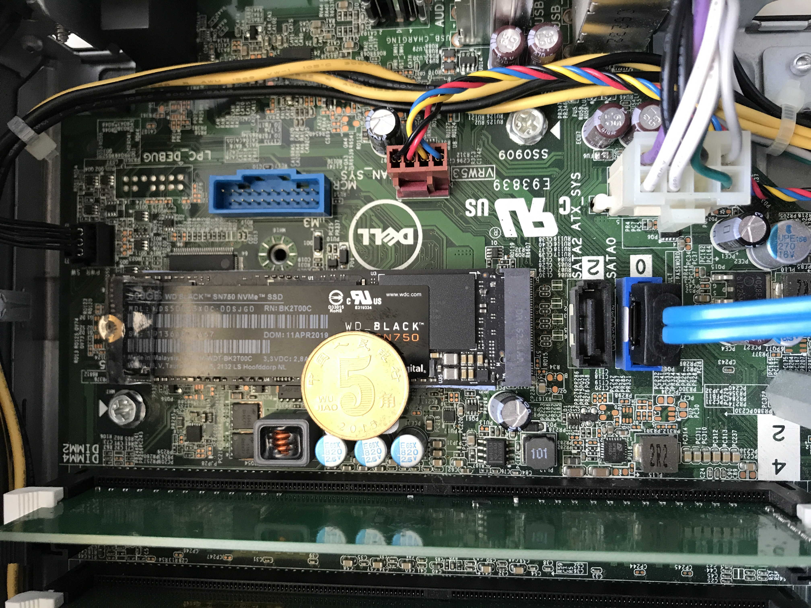
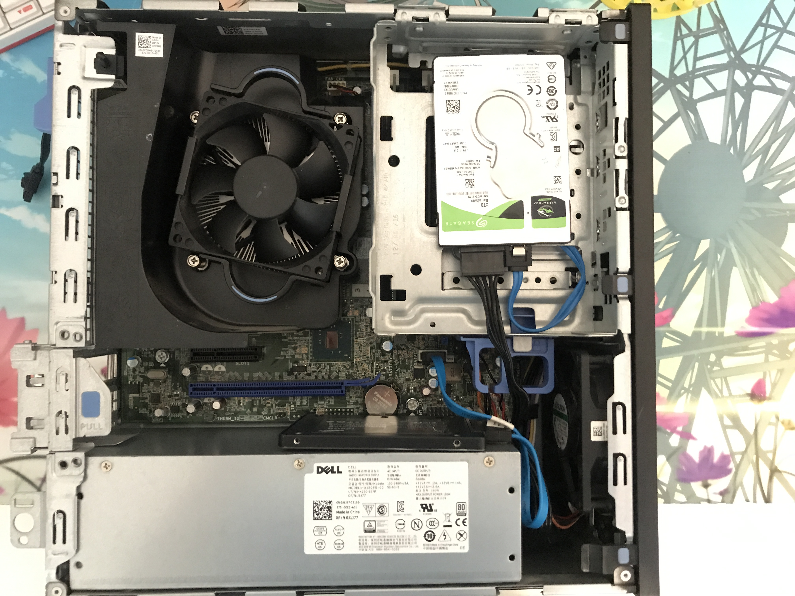
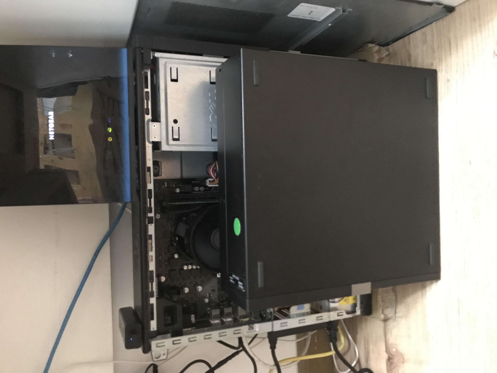

## 捡垃圾

作为一名运维工程师，白天在工地上搬砖养家糊口，晚上下班回家后就开始折腾一堆破铜烂铁自娱自乐😂。最近东拼西凑花了 2000 来块钱捡垃圾整了台 homelab 玩玩，折腾一些没用的东西🙃

其实很早之前就想搞一台低功耗的 HomeLab 主机玩儿了，最早开始选择的是 Dell T1700 SFF + E3-1271V3 +32GB DDR3，但是呢，E3 V3 系列是 Intel 第四代  CPU ，1150 芯片组无法从 M.2 启动，磁盘速度只能达到 SATA III 也就是顶多 600 MB/s 的读写速度，而目前随便一块支持  PCI-e M.2 NVMe 的主板普遍都能达到 3000MB/s 了。所以这一点来讲 E3 V3 已经不值得捡了。而且我想把我台式机上 SN750 500GB 换到这台机器上，所以还是要选择一个支持 PCI-e M.2 NVMe 的主板。

| 硬件 | 配置                                         | 价格 |
| :--: | -------------------------------------------- | :--: |
| CPU  | Intel(R) Core(TM) i5-6600T CPU @ 2.70GHz 35w | 480  |
| 主板 | Dell OptiPlex 7040 准系统：Intel ®Q170       | 400  |
| 内存 | 镁光 DDR4 16GB 2666MHz                       | 310  |
| 显卡 | 英特尔® 核芯显卡 530                         |  0   |
| 机箱 | Dell OptiPlex 7040 准系统                    |  0   |
| 电源 | Dell OptiPlex 7040 准系统：290W 开关电源     |  0   |
| UPS  | 某杂牌 UPS 650VA360W                         | 160  |
| 固态 | 三星 970PRO 512GB                            | 820  |
| 总价 |                                              | 2170 |

其实本来的预算三星 970PRO 512GB没打算买，是我在找 Dell OptiPlex 7040 时意外碰到的一个老哥，而且这块固态是德亚的，还算靠谱一些，于是剁手买了这个块固态。970PRO 系列的都是 MLC 的颗粒的固态硬盘，通 SM961 一样是属于传家宝系列😂，但是 SM961 淘宝上水太深，清零盘占据多数，所以不建议买。

正好把这块 970PRO 换到我的台式机上，把台式机上的 SN750 512GB 换到 HomeLab 机器上，给 ESXi 上的虚拟机用。在玩儿虚拟化的时候深有感触，宿主机的磁盘是机械硬盘的话，上面的虚拟机达到一定数量时，虚拟机会很卡，所以玩 ESXi 虚拟化，有块固态的体验是非常爽滴😋。

至于 6600T 的性能，在 500 块钱的价位内 35W低功耗的 6600T 还算可以能接受，为什么不买 7200U 这种低压 U 呢？，一是低压 U 的装机成本太高，而且性价比很低，我还要在上面跑一堆虚拟机，低压 U 恐怕扛不住，所以一开始就放弃了低压 U 的装机方案。


## 装机

其实装机很快，由于是买的 Dell OptiPlex 7040 准系统，所以只需要把 CPU 、内存、硬盘装上去就完事儿了。

收到准系统后发现没有带 M.2 螺丝，只能临时拿胶带粘糊上去，勉强撑了两天，后来买了个螺丝和散热片完美地解决了。



从以前旧笔记本淘汰下来的 2TB 5400RPM 的石头盘，已经出现坏道了，临时当个下载盘吧，在它还没彻底崩盘之前再压榨一下它吧😂。后面打算再添加一块12TB的氦气盘当仓库盘和备份数据使用，有了 UPS 和这台主机 7*24 小时开机也没啥问题了。



后面那台是我的台式机，也是去年这时候买的，两者比较起来 SFF 的型号确实小很多。Dell 的这种主机还有一种 MFF 型号的，那种更小一些，差不多比路由器大一些而已，不过扩展性不好，而且还需要外置电源，也就没考虑，不过现在想想有点后悔了，当初应该多加点钱买 SFF 的，不过还好也能接受，只不过体积大了些，搬家的时候不太方便。




[](img/homelab-6.jpg)


[](img/homelab-2.jpg)

## ESXi

### Ubuntu 20.04

顺带用 [ZBench](https://github.com/Aniverse/ZBench) 测了一下虚拟机的磁盘性能，还算勉强说的过去。

```ini
--------------------------------------------------------------------------
CPU model            : Intel(R) Core(TM) i5-6600T CPU @ 2.70GHz
Number of cores      : 4
CPU frequency        : 2712.000 MHz
Total size of Disk   : 33.3 GB (7.7 GB Used)
Total amount of Mem  : 3935 MB (306 MB Used)
Total amount of Swap : 3934 MB (0 MB Used)
System uptime        : 4 days, 19 hour 47 min
Load average         : 0.13, 0.08, 0.03
OS                   : Ubuntu 20.04 LTS
Arch                 : x86_64 (64 Bit)
Kernel               : 5.4.0-42-generic
Virt                 : vmware
--------------------------------------------------------------------------
I/O speed(1st run)   :1.3 GB/s
I/O speed(2nd run)   :1.3 GB/s
I/O speed(3rd run)   :1.3 GB/s
```

### PhotonOS

### Alpine

### Windows

### NFS

主要用来给我的 Pod 持久化存储挂 PVC 使用。

### Debian

## 额外硬件

### UPS

由于最近房东家里经常断电，有时一天断电八九次，每次断电我都担心着硬盘里的老婆们会不会挂掉，索性还是买了 UPS ，在马云家看了看，带给 NAS 自动断电的 UPS 普遍在 400块钱以上，而且我这个还是个假的 NAS ，UPS 上的 USB 口不一定支持我的主机。最后为了节省一下预算花儿 160 块钱买了个不支持 USB 的 UPS ，但是又不能没有这个功能，因为家里的 220V 市电断电之后，UPS 的电量只能给主机续命 10~20min 左右，UPS 的电量用完之后就嗝屁了，照阳还是断电。所以在 UPS 用尽电量还是没有来电之前，一定要想办法把主机通过 poweroff 的方式安全优雅滴关机。

首先要考虑的是怎么知道 220V 市电断电了，起初想有没有个 220V 的传感器，我去，有点难度还是算了吧。最后一想，可以通过 ping 房东家光猫的方式。我的路由器和主机等设备连接 UPS ，房东家的光猫并没有连接 UPS ，我在路由器上设置一个定时任务，每分钟去 ping 房东家的光猫，没有 ping 通说明就是断电了，也有可能是网线被拔掉了，但概率很小。`! ping -c 8 A && ssh B "poweroff"` 一行简单的命令就满足了我的需求，

```shell
#!/bin/sh
echo "start" >> /tmp/power_status
if ! ping -c 32 192.168.1.1
then
    sleep 300
    ping -c 32 192.168.1.1 && exit 0
    sshpass -p "pwd" ssh root@192.168.0.210 "net rpc shutdown -I 192.168.0.240 -U admin%poweroff"
    sshpass -p "pwd" ssh root@192.168.0.200 "sh -c /suspend_vm.sh"
    echo "220v poweroff" >> /tmp/power_status
fi
```

对于 ESXi 上的虚拟机，还是采用了挂起的方式，将虚拟机的内存状态保存在数据存储的磁盘里，这样重新开启虚拟机后就能恢复到之前的状态，这一点有点像 Windows 的休眠。

```shell
#!/bin/sh
for vm in $(/sbin/vmdumper -l | grep -v Alpine |  awk '{print $1}' | sed 's/wid=//g')
do
     /sbin/vmdumper ${vm} suspend_vm
done
```

### 远程开关

